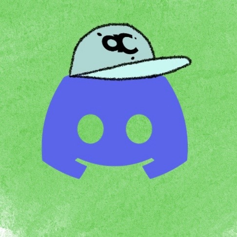
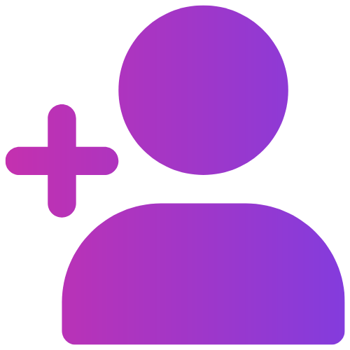

# DadBot

# What Is DadBot?
**

# Invite Link  

# Built with 

      

# Commands

Command|Description 
--- | ---
/dad-joke|Returns a random Dad joke.
/search-joke|Returns and specific joke. 
/add-joke|Returns the joke that you add in the input.
/my-jokes|Returns all you favorite jokes.
/dad-gif|Returns a random dad joke gif.
/get-dads|Returns the devs information.
!dad-help|Returns a Youtube video.

# Dads Team 

Alejandra El-Dasouki:  
 | 

Austin Han:  
 | 

Brien Thomas:   
 | 

Olivia Passion:  
 | 

# Our Plan

